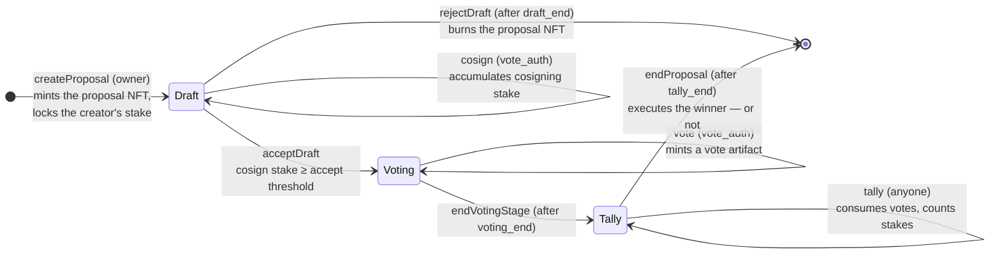

# DAO Protocol — Usage Guide

How to deploy and operate the **DAO governance protocol**: token-weighted
governance of a protocol and its treasury. Token holders **stake** tokens
into positions, **propose** actions, **vote** with weight proportional to
their stake, and — once thresholds are met — a proposal resolves to an
**effect** script that executes the approved action.

Three cooperating validators guard the state, each with its own
NFT-guarded UTxO (policy id = the validator's own hash, token name = hash of
a consumed output reference):

| Validator | UTxO | Carries |
|---|---|---|
| **`stake`** | Stake position | The holder's staked governance tokens + live locks |
| **`proposal`** | Proposal | The lifecycle state machine (Draft → Voting → Tally → closed) |
| **`vote`** | Vote artifact | One holder's vote on one proposal; destroyed at tally |

Governance parameters (thresholds, timings, and the sibling validator
hashes) are **not** compiled in — they are read at runtime from a
[settings](#prerequisite-a-settings-instance) UTxO located by its NFT via
reference input.

> **Source of truth.** Behavior, threat model, and invariants are specified in
> [`spec.md`](spec.md).
> This guide only covers day-to-day usage.

| Part | Where |
|---|---|
| On-chain validators | [`onchain/validators/dao/`](../../onchain/validators/dao/) (+ composable predicates in [`onchain/lib/dao/`](../../onchain/lib/dao/)) |
| MeshJS builders | [`offchain/meshjs/lib/src/dao/`](../../offchain/meshjs/lib/src/dao/) |
| Tx3 protocol + client | [`offchain/tx3/dao/`](../../offchain/tx3/dao/) |
| Compiled blueprint | [`onchain/plutus.json`](../../onchain/plutus.json) |

## Contents

- [Proposal lifecycle](#proposal-lifecycle)
- [Roles](#roles)
- [Prerequisite: a settings instance](#prerequisite-a-settings-instance)
- [Deploying an instance](#deploying-an-instance)
- [Stake positions (MeshJS)](#stake-positions-meshjs)
- [Proposal lifecycle (MeshJS)](#proposal-lifecycle-meshjs)
- [Voting and tallying (MeshJS)](#voting-and-tallying-meshjs)
- [Off-chain usage: Tx3 client](#off-chain-usage-tx3-client)
- [Gotchas and safety notes](#gotchas-and-safety-notes)
- [Where to go next](#where-to-go-next)

## Proposal lifecycle



All deadlines derive from the proposal's immutable `start_time` (the create
transaction's validity lower bound) and `timing_config`:

```
draft_end   = start_time + draft_length
voting_end  = draft_end + voting_length
tally_end   = voting_end + tally_length
```

- **Cosign / AcceptDraft** must be included by `draft_end`; an unaccepted
  draft is rejected (burned) after it.
- **Vote** must be included by `voting_end`; the vote's stake stays locked
  until then.
- **Tally** must complete by `tally_end` — every `EndVotingStage` delay
  shrinks this window.
- **EndProposal** closes the poll: the **strict winner** (unique highest
  total, no tie) is declared; its effect script runs as a withdraw-0 only if
  the total meets the `execute` threshold.

## Roles

| Role | Who | Powers |
|---|---|---|
| **Owner** | A `Credential` in a stake position | Deposit, withdraw, delegate, close, create proposals |
| **Delegatee** | Optional `Credential` in a stake position | Cosign and vote on behalf of the position |
| **Proposer / Cosigner / Voter** | Any sufficiently-staked position | Perform the corresponding governance actions |
| **Settings authority** | Holder of `propose_auth`/`apply_auth` on the settings contract | Changes `DaoSettings` (thresholds, timings, sibling hashes) |
| **Effect (poll) scripts** | Per-option validators named in a proposal's `results` | Execute the approved action; must self-verify victory |

Authorization uses pluggable `Credential`s (key = required signer, script =
withdraw-0 invocation), so keys, multisigs, DAOs, or smart wallets can hold
any role.

## Prerequisite: a settings instance

The DAO validators read `DaoSettings` from the settings contract's opaque
`current` datum — the settings protocol governs the DAO's parameters. You
need a live settings instance (see the
[settings usage guide](../settings/usage.md)) whose `current` is:

```ts
import { daoSettingsToData, type DaoSettings } from "@contracts-library/meshjs";

const daoSettings: DaoSettings = {
  thresholds: { create: 1000n, cosign: 500n, accept: 2000n, vote: 1n, execute: 3000n },
  timings: { draftLength: 86_400_000, votingLength: 432_000_000, tallyLength: 86_400_000 },
  stakeValidator: resolveScriptHash(stake.code, stake.version),       // = stake NFT policy
  proposalValidator: resolveScriptHash(proposal.code, proposal.version), // = proposal NFT policy
  voteValidator: resolveScriptHash(vote.code, vote.version),          // = vote NFT policy
};

// Stored as the settings UTxO's `current`:
const settingsDatum = {
  current: daoSettingsToData(daoSettings),
  next: null,
  nextApply: null,
};
```

If the settings `current` does not cast to a well-formed `DaoSettings`,
every settings-reading action fails (Create Proposal, Cosign, Vote, Tally).

## Deploying an instance

All three DAO validators share the same parameters; the reference effect is
parameterized by the proposal validator's hash:

| Parameter | Shared by | Meaning |
|---|---|---|
| `stakeTokenPolicy` / `stakeTokenName` | stake, proposal, vote | The governance token (policy + name, hex) |
| `settingsPolicy` / `settingsTokenName` | stake, proposal, vote | The settings NFT the DAO reads its parameters from |
| `proposalPolicy` | `poll_effect` only | The proposal validator's hash, **pinned at compile time** on-chain |

**Deploy in this order** — each step's output parameterizes the next:

1. **Settings script** (parameters include the settings seed; see the
   [settings guide](../settings/usage.md)) → yields `settingsPolicy`.
2. **Stake / proposal / vote scripts** — parameterized with the governance
   token and settings policy/name:

   ```ts
   import {
     pollEffectScript, proposalScript, stakeScript, voteScript,
     type ProposalParams, // structurally identical to StakeParams / VoteParams
   } from "@contracts-library/meshjs";

   const params = {
     stakeTokenPolicy,  // governance token policy id
     stakeTokenName,    // governance token asset name (hex)
     settingsPolicy,    // settings script hash (= settings NFT policy id)
     settingsTokenName, // settings NFT asset name
   };
   const stake = stakeScript(params);
   const proposal = proposalScript(params);
   const vote = voteScript(params);
   ```

3. **Effect scripts** — one per vote option, each parameterized by the
   proposal validator's hash (after step 2) and typically deployed as
   reference scripts. The reference candidate guards itself with
   `am_i_the_winner`:

   ```ts
   const effect = pollEffectScript({
     proposalPolicy: resolveScriptHash(proposal.code, proposal.version),
   });
   const effectHash = resolveScriptHash(effect.code, effect.version);
   ```

The option list a proposal carries in `results` is `List<ScriptHash>`:
index = option id, so a proposal with three options references three effect
hashes.

## Stake positions (MeshJS)

The MeshJS builders are the primary developer-facing API. Install:

```sh
npm install @contracts-library/meshjs @meshsdk/core
```

A position's **frozen** stake is `max(lock.stake)` over its live locks (not
the sum) — the same tokens can back several proposals at once. **Free**
stake is `total − frozen`. A lock expires when `unlock_time <= now`.

### Create a position

Ownership is established by proof-of-spend of the `seedUtxo` — no signature
check on-chain (though the builder adds the owner as a required signer for
key credentials):

```ts
await buildCreateStakePositionTx({
  txBuilder,
  script: stake,
  seedUtxo,                        // the owner's UTxO: mint seed + funds the first stake
  owner: { keyHash: ownerKeyHash },
  datum: { owner: { kind: "key", hash: ownerKeyHash }, delegatee: null, locks: [] },
  stakedTokens: [{ unit: stakeTokenUnit, quantity: "1000" }],
  utxos: ownerUtxos,
  changeAddress: ownerAddress,
  collateralUtxo,
  network: "preprod",
});
```

The position NFT name is derived automatically from the seed
(`blake2b_256` of the consumed output reference).

### Position maintenance

Deposit, withdraw, delegate, and close all spend the position UTxO and share
the `StakeSpendParams` base (plus `owner`, `now`, wallets, collateral).
**You supply the continuation datum** — including pruning expired locks —
while the builder sets the validity lower bound from `now`:

```ts
const pruned = { ...positionDatum, locks: pruneExpired(positionDatum.locks, now) };

await buildDepositTx({
  txBuilder, script: stake,
  stakeUtxo: position,
  datum: pruned,
  addedTokens: [{ unit: stakeTokenUnit, quantity: "500" }],
  owner: positionDatum.owner,
  now, utxos, changeAddress, collateralUtxo, network: "preprod",
});
```

- `buildWithdrawTx` — takes `amount: bigint` and `stakeTokenUnit`; must not
  exceed the free stake.
- `buildDelegateTx` — takes `delegatee: { keyHash } | null` (set, change, or
  clear); locks pass through untouched.
- `buildClosePositionTx` — burns the position NFT and returns everything;
  **all locks must already be expired**.

## Proposal lifecycle (MeshJS)

### Create a proposal

One transaction: spends the owner's position (recording a draft lock) and
mints the proposal NFT. Requires the settings UTxO as a reference input
(both the `create` threshold and the sibling hashes are read on-chain):

```ts
const now = Date.now();
const proposalTokenName = nftNameFromRef(position.input); // NFT name = hash of the position's ref

await buildCreateProposalTx({
  txBuilder,
  proposalScript: proposal,
  stakeScript: stake,
  stakeUtxo: position,
  stakeDatum: {
    ...positionDatum,
    locks: [...positionDatum.locks,
      { proposalId: proposalTokenName, unlockTime: now + settings.timings.draftLength,
        stake: positionStake }],
  },
  settingsUtxo,
  proposalDatum: {
    thresholds: settings.thresholds,   // snapshotted — immutable hereafter
    timingConfig: settings.timings,
    startTime: now,
    status: { kind: "Draft", cosigningStake: positionStake },
    results: [effectHash],             // one effect hash per vote option
  },
  now,
  utxos, changeAddress, collateralUtxo, network: "preprod",
});
```

The creator's staked amount must meet the `create` threshold at creation
time.

### Draft phase: cosign, accept, reject

```ts
// Cosign: another position commits its stake; must be included before draft_end.
await buildCosignProposalTx({
  txBuilder,
  script: proposal,
  proposalUtxo, datum: proposalDatum,
  proposalDatum: {
    ...proposalDatum,
    status: { kind: "Draft", cosigningStake: currentCosignStake + cosignerStake },
  },
  stakeScript: stake,
  stakeUtxo: cosignerPosition,
  stakeDatum: {
    ...cosignerDatum,
    locks: [...cosignerDatum.locks,
      { proposalId, unlockTime: draftEnd, stake: cosignerStake }],
  },
  settingsUtxo,                        // required: cosign reads the stake validator hash
  now, utxos, changeAddress, collateralUtxo, network: "preprod",
});
```

A position cannot cosign the same proposal twice while its lock is live, and
the cosigner's stake must meet the `cosign` threshold.

```ts
// Accept: anyone can promote the draft once cosign stake >= the accept threshold.
await buildAcceptDraftTx({
  txBuilder, script: proposal, proposalUtxo, datum: proposalDatum,
  continuationDatum: { ...proposalDatum, status: { kind: "Voting" } },
  now, utxos, changeAddress, collateralUtxo, network: "preprod",
});

// Reject: after draft_end, anyone can burn an unaccepted draft.
await buildRejectDraftTx({
  txBuilder, script: proposal, proposalUtxo, datum: proposalDatum,
  now, utxos, changeAddress, collateralUtxo, network: "preprod",
});
```

## Voting and tallying (MeshJS)

### Vote

One transaction: spends the voter's position (recording a voting lock) and
mints the vote artifact. The proposal UTxO is referenced, not spent:

```ts
await buildVoteTx({
  txBuilder,
  voteScript: vote,
  stakeScript: stake,
  stakeUtxo: voterPosition,
  stakeDatum: {
    ...voterDatum,
    locks: pruneExpired([...voterDatum.locks,
      { proposalId, unlockTime: votingEnd, stake: voterStake }], now),
  },
  proposalUtxo,                        // reference input
  proposalDatum,
  settingsUtxo,                        // required: vote reads the vote validator hash
  voteDatum: {
    stakeOwner: voterDatum.owner,
    proposal: proposalTokenName,
    votedOption: 0,                    // index into the proposal's `results`
    stake: voterStake,                 // exact weight counted at tally
  },
  now,
  utxos, changeAddress, collateralUtxo, network: "preprod",
});
```

Authorization is `vote_auth` (the delegatee if set, else the owner). The
voter's stake must meet the `vote` threshold and the inclusion deadline is
`voting_end` (set by the builder from `proposalDatum`).

**Cancel** (`VoteRedeemer::Cancel` + `BurnVotes`): the recorded
`stake_owner` can burn an un-tallied vote at any time — there is no
deadline. The position's stake is freed only when the *lock* expires, not at
cancel time. The Tx3 client exposes this as `client.cancel`; with MeshJS,
assemble the transaction from the exported redeemer helpers
(`cancelVoteRedeemer`, `burnVotesRedeemer`).

### Tally

Anyone can tally. Votes are consumed in batches: stakes are folded into the
per-option totals, vote NFTs are burned, and each vote's lovelace is refunded
to its recorded owner (tagged with the vote's output reference). The
`ownerAddress` per vote must be the vote's recorded `stake_owner`:

```ts
await buildTallyTx({
  txBuilder,
  script: proposal,
  proposalUtxo,
  datum: tallyDatum,
  continuationDatum: {
    ...tallyDatum,
    status: { kind: "Tally", votes: countedTotals },  // consumed votes folded in
  },
  settingsUtxo,                        // required
  voteScript: vote,
  votes: votes.map((v) => ({ voteUtxo: v, ownerAddress: ownerAddressOf(v) })),
  now, utxos, changeAddress, collateralUtxo, network: "preprod",
});
```

One proposal per tally transaction, and a canceled vote can never influence
a tally (the burned-count check forbids canceling inside the counting
transaction without being counted).

### End the proposal

After `tally_end`, anyone closes the poll. The builder derives the strict
winner from the `EndProposal` redeemer you declare via `winnerEffect`
— pass it only when the winning option's total meets the `execute`
threshold; otherwise omit it and the poll closes with nothing executed:

```ts
await buildEndProposalTx({
  txBuilder, script: proposal, proposalUtxo, datum: tallyDatum,
  now,
  winnerEffect: { script: effect },    // omit when there is no executable winner
  utxos, changeAddress, collateralUtxo, network: "preprod",
});
```

The declared effect runs as a withdraw-0 in the same transaction. Losing
effects are not blocked from running their own withdrawals — guarding
against an illegitimate victory claim is each effect script's own job
(`am_i_the_winner`).

## Off-chain usage: Tx3 client

The Tx3 implementation lives in
[`offchain/tx3/dao/`](../../offchain/tx3/dao/) with a generated client in
[`codegen/ts-client/dao-governance`](../../offchain/tx3/dao/codegen/ts-client/dao-governance/README.md)
(regenerate with `trix codegen`; do not edit by hand). Unlike the MeshJS
builders it also covers **vote cancel** and the settings launch
(`launchSettings` mints the settings NFT with a typed `DaoSettings` as
`current`).

Install the runtime SDK in the directory that consumes the client:

```sh
npm install tx3-sdk
```

### Set up the client

```ts
import { Client } from "./codegen/ts-client/dao-governance";
import { Party } from "tx3-sdk";

const client = (signer: Party) =>
  new Client({ endpoint: "http://localhost:8164" }, "local")
    .withSigner(signer)                            // stake owner or delegatee
    .withStake(Party.address(stakeAddr))
    .withProposal(Party.address(proposalAddr))
    .withVote(Party.address(voteAddr))
    .withSettings(Party.address(settingsAddr));
```

Bind the protocol environment once per instance — parameterized script
hashes and their flat single-CBOR forms, the governance token, and the
effect authorizer's reference:

```ts
const env = {
  stake_hash: stakeHash,      stake_script: flatStakeCbor,
  proposal_hash: proposalHash, proposal_script: flatProposalCbor,
  vote_hash: voteHash,         vote_script: flatVoteCbor,
  settings_hash: settingsHash, settings_script: flatSettingsCbor,
  staked_token_policy: tokenPolicy,
  staked_token_name: tokenName,
  staked_token_script: tokenMintScriptCbor,   // devnet test kit only
  effect_script_ref: effectRefUtxo,
  effect_reward_address: `f0${effectHash}`,   // CIP-19 script reward address bytes
};
```

Every `tx` exposes the four-stage lifecycle `resolve → sign → submit → wait`
(see the [Tx3 consuming guide](https://docs.txpipe.io/tx3/consuming/quick-start)).
The template's runtime argument names are **snake_case** while the generated
parameter types declare camelCase — cast past them at each call site, as the
reference harness does
([`offchain/tx3/dao/tests/devnet.test.ts`](../../offchain/tx3/dao/tests/devnet.test.ts)).

### Key actions

```ts
// Launch the settings instance with the typed DAO configuration
await client(governor)
  .launchSettings({ seed: settingsSeedRef, dao_settings: daoSettings, out_ix: 0 })
  .env(env).resolve().then((r) => r.sign()).then((s) => s.submit());

// Open a stake position (ownership by proof-of-spend of the seed)
await client(owner)
  .createStakePosition({
    seed, owner_utxo: { transaction_id: seedTxHash, output_index: seedIx },
    owner: keyCred(ownerKeyHash),
    stake_amount: stake, stake_nft_name: toBytes(nftNameFromRef(seed)), out_ix: 0,
  })
  .env(env).resolve().then((r) => r.sign()).then((s) => s.submit());

// Create a proposal (settings UTxO resolved as a reference input)
await client(owner)
  .createProposal({
    settings_ref: settingsRef, stake_ref: positionRef,
    proposal_token_name: toBytes(proposalTokenName), results: [effectHashBytes],
    new_stake_datum: stakeDatumWithDraftLock,
    new_proposal_datum: proposalDatumDraft,
    since_slot: tipSlot, out_ix: 1,
  })
  .env(env).resolve().then((r) => r.sign()).then((s) => s.submit());

// Vote (proposal referenced, settings resolved, vote artifact minted)
await client(voter)
  .vote({
    settings_ref: settingsRef, proposal_ref: proposalRef, stake_ref: positionRef,
    proposal_id: toBytes(proposalTokenName), voted_option: 0,
    since_slot: tipSlot, until_slot: votingEndSlot,
    vote_nft_name: toBytes(voteNftName),
    vote_datum: voteArtifact, new_stake_datum: stakeDatumWithVoteLock, out_ix: 0,
  })
  .env(env).resolve().then((r) => r.sign()).then((s) => s.submit());

// Tally one vote artifact per call (refund tagged with the vote's own reference)
await client(anyone)
  .tally({
    settings_ref: settingsRef, proposal_ref: proposalRef, vote_ref: voteRef,
    vote_output_ref: voteOutputRef, vote_nft_name: toBytes(voteNftName),
    refund: voterAddress, new_proposal_datum: proposalDatumTallyUpdated,
    until_slot: tallyEndSlot, out_ix: refundIx,
  })
  .env(env).resolve().then((r) => r.sign()).then((s) => s.submit());

// Close the poll: always-executes winner …
await client(anyone)
  .endProposal({
    proposal_ref: proposalRef, proposal_token_name: toBytes(proposalTokenName),
    effect_hash: winnerEffectHash, since_slot: tallyEndSlot,
  })
  .env(env).resolve().then((r) => r.sign()).then((s) => s.submit());

// … or a poll with no executable winner (tie / below the execute threshold)
await client(anyone)
  .endProposalFailed({ proposal_ref: proposalRef, since_slot: tallyEndSlot })
  .env(env).resolve().then((r) => r.sign()).then((s) => s.submit());
```

The full action set: `launchSettings`, `createStakePosition`, `deposit`,
`withdraw`, `delegate`, `closePosition`, `createProposal`, `cosign`,
`acceptDraft`, `rejectDraft`, `endVotingStage`, `tally`, `endProposal`,
`endProposalFailed`, `vote`, `cancel`.

Notes:

- **Key-authorized paths only.** The reference implements the key-credential
  authorization (`Signer` = the stake owner, or the delegatee when one is
  set); script-credential authorization would require script-authorized tx
  variants.
- **Settings reference inputs.** Only `createProposal`, `cosign`, `vote`, and
  `tally` take `settings_ref` — matching the on-chain validators. The other
  transactions carry none.
- **Devnet kit only.** `devnetPay`, `devnetDeployAuthorizer`,
  `devnetMintStaked` (and the `Faucet`/`Publisher` parties) exist to
  bootstrap a trix devnet in tests; never use them in production builders.

## Gotchas and safety notes

- **Snapshotting.** The `create` threshold is read live at creation; the
  other thresholds, the timings, and the sibling hashes are copied into the
  proposal and frozen. Settings updates only affect proposals created
  afterwards.
- **Settings authority is trusted.** Whoever can change the settings UTxO's
  `current` can change the DAO's thresholds, timings, and sibling script
  hashes; a malformed `current` halts Create Proposal, Cosign, Vote, and
  Tally until fixed.
- **One proposal tally per transaction.** A tally's burned-vote count must
  match the votes counted for that proposal, which precludes tallying two
  proposals (or mixing in a `Cancel`) in one transaction. The Tx3 `tally`
  takes exactly one vote per call; the MeshJS builder batches.
- **Vote cancellation has no deadline.** A voter can retract a vote
  mid-voting; the position's stake is freed when the lock expires, not at
  cancel time.
- **Effect scripts are untrusted.** Being in `results` proves nothing; each
  candidate must verify its own victory with `am_i_the_winner` (pin
  `proposal_policy` at compile time — deriving it from transaction data would
  let anyone forge an approving poll) and compose further business logic
  with `and`.
- **Locks freeze the max, not the sum.** Free stake = total − the largest
  live lock. The intended `max_locks = 100` cap is a design note, not yet
  implemented; the pruning paths (`Deposit`, `Withdraw`, `ClosePosition`) and
  `DelegateTo` make datum bloat temporary and revocable.
- **Tally DoS budget.** Guaranteeing every vote can be tallied in time needs
  `vote_threshold ≥ (supply × avg_block_ms) / tally_length_ms`. Nothing
  enforces the supply assumption — update settings **before** minting more
  governance tokens, and wait for proposals created under the old parameters
  to finish first.
- **Delayed stage transitions shrink the tally window.** `EndVotingStage` is
  only lower-bounded (`now >= voting_end`), so someone must advance the poll
  promptly — assume at least one honest actor (any voter wants their vote
  counted).
- **Script credentials need manual wiring (MeshJS).** The DAO builders add
  required signers for key credentials only; to authorize by script
  (multisig, DAO, smart wallet), attach the withdraw-0 authorizer to the
  `txBuilder` yourself (see `applyAuthorization` in
  [`offchain/meshjs/lib/src/authorization.ts`](../../offchain/meshjs/lib/src/authorization.ts)
  and ARCHITECTURE.md §3).

## Where to go next

- [Spec](spec.md) — full transaction tables (§5),
  threat model, invariants, and assumptions (§6).
- [On-chain code](../../onchain/validators/dao/) — the four validators;
  composable predicates and tests in [`onchain/lib/dao/`](../../onchain/lib/dao/).
- [MeshJS e2e tests](../../offchain/meshjs/e2e/test/dao.e2e.test.ts) —
  the complete happy path against a Yaci devnet, including
  [maximum-tally batching](../../offchain/meshjs/e2e/test/dao-tally-max.e2e.test.ts).
- [Tx3 devnet test](../../offchain/tx3/dao/tests/devnet.test.ts) — the
  full lifecycle with the generated client, plus negative (must-reject) cases.
- [Settings usage guide](../settings/usage.md) — operating the
  settings instance that governs this protocol's parameters.
- [Architecture](../ARCHITECTURE.md) — composability conventions shared by
  every contract in the library.
