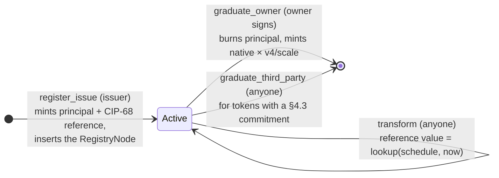

# Event-Triggered Assets — Usage Guide

How to deploy and operate the **tokenized bond**, a CIP-113 programmable
token that records a fixed schedule of value and settles into a plain native
asset at maturity. One transaction **registers** the instrument with the
CIP-113 core registry and **issues** the first tokens; afterwards the tokens
move **freely**, the bond's recorded value steps up at each deadline
(holder-passively), and from the final deadline on any holder may
**graduate**: burn the principal, receive the native mirror.

The instrument ships four withdraw-zero validators plus a native mint policy
(see the on-chain listing below), all exercised **by the CIP-113 core
infrastructure**: the Programmable Logic Base custodies every token UTxO and
dispatches spends to the transfer / third-party logic, and the parameterized
`issuance_mint` policy invokes the minting logic on every mint/burn. There is
deliberately no spend or mint endpoint of our own.

> **Source of truth.** Behavior, threat model, and invariants are specified in
> [`spec.md`](spec.md).
> This guide only covers day-to-day usage.

| Part | Where |
| --- | --- |
| On-chain validators | [`onchain/validators/event_triggered_assets.ak`](../../onchain/validators/event_triggered_assets.ak) (+ predicates in [`onchain/lib/event_triggered/`](../../onchain/lib/event_triggered/)) |
| MeshJS builders | [`offchain/meshjs/lib/src/event_triggered/`](../../offchain/meshjs/lib/src/event_triggered/) |
| Tx3 protocol + client | [`offchain/tx3/event-triggered-assets/`](../../offchain/tx3/event-triggered-assets/) |
| Compiled blueprint | [`onchain/plutus.json`](../../onchain/plutus.json) |

## Contents

- [Lifecycle](#lifecycle)
- [Roles](#roles)
- [Prerequisite: the CIP-113 core](#prerequisite-the-cip-113-core)
- [Deploying an instrument](#deploying-an-instrument)
- [Register + first issue (MeshJS)](#register--first-issue-meshjs)
- [Transfer, payout key, transform (MeshJS)](#transfer-payout-key-transform-meshjs)
- [Graduation (MeshJS)](#graduation-meshjs)
- [Off-chain usage: Tx3 client](#off-chain-usage-tx3-client)
- [Gotchas and safety notes](#gotchas-and-safety-notes)
- [Where to go next](#where-to-go-next)

## Lifecycle



The schedule `[(d1,v1) … (d4,v4)]` is **baked as validator constants**
(precomputed off-chain in fixed-point `scale` units, `v4 ≈ 1.1699 × scale`).
Deadlines:

- **transform** — the validity lower bound must satisfy `d1 ≤ now ≤ d4`;
  a late submission (`now ≥ d_{k+1}`) simply lands on the current step —
  staleness costs nothing.
- **graduation** — the validity lower bound must reach `d4`; afterwards the
  window stays open with **no upper bound** (graduation is opt-in, never
  forced).
- **transfer** and **payout-key** read no time bound.

## Roles

| Role | Who | Powers |
| --- | --- | --- |
| **Issuer** | The registration authority baked into the minting logic | Signs the atomic register + first issue |
| **Owner** | The token UTxO's inline stake credential | Transfers freely, pre-commits a payout credential, graduates |
| **Third party** | Anyone | Completes a graduation for tokens whose owner opted in (§4.3) |
| **Submitter** | Anyone | Runs the holder-passive §4.4 transform (fees only) |

Authorization: the issuer is a pluggable `Credential` (key = required signer,
script = withdraw-0). The graduation's payout destination is bound by the
owner's signature **or** the §4.3 pre-committed payment credential.

## Prerequisite: the CIP-113 core

Unlike the settings/DAO protocols, this instrument runs **inside** the
CIP-113 programmable-token framework (see
[`documentation/09-DEVELOPING-MODULES.md`](../../../cip113-programmable-tokens/documentation/09-DEVELOPING-MODULES.md)).
Before any instrument transaction, the core must be deployed:

1. **Parameterize the core scripts** in dependency order — the one-shot
   `OutputReference` seeds and the sibling script hashes chain into each
   other (the e2e harness
   [`offchain/meshjs/e2e/src/cip113/scripts.ts`](../../offchain/meshjs/e2e/src/cip113/scripts.ts)
   is the reference).
2. **Genesis transactions** — registry origin node, `IssuanceCborHex`
   template, upgrade-multisig config, protocol params
   ([`offchain/meshjs/e2e/src/cip113/deploy.ts`](../../offchain/meshjs/e2e/src/cip113/deploy.ts)
   is the reference; the Tx3 protocol carries the same four as
   `core_init_registry` / `core_init_cbor_hex` /
   `core_init_upgrade_config` / `core_init_protocol_params`).
3. **Register every withdraw-0 stake credential** — Conway evaluates the
   `publish` script purpose for script-credential registrations, so each
   module's own script must ride along as the certificate witness.
4. **Apply the bond's parameters** — the minting logic, transfer logic,
   third-party logic and transformation script are parameterized with the
   core's `registryNodeCs`, the issuer credential, the sibling logic hashes,
   the asset names, the schedule and the scale.

> **Dependency order.** The governed policy id is a hash *of* the
> `issuance_mint` script applied to the minting-logic credential, so no
> validator may bake it — the instrument validators resolve it at runtime from
> the registry node. Only the native mint policy (outside that cone) bakes
> `cipPolicy`.

## Deploying an instrument

```ts
import {
  issuanceScript, nativeMintPolicyScript, policyIdOf, scriptHashOf,
  thirdPartyScript, transferScript, transformationScript,
  type MintingParams, type NativeMintParams, type ThirdPartyParams,
  type TransferParams, type TransformationParams,
} from "@contracts-library/meshjs";

const schedule = [
  { deadline: d1, value: v1 }, …, { deadline: d4, value: v4 },
];

const transformation = transformationScript({
  referenceName: REFERENCE, schedule,
} satisfies TransformationParams);
const transfer = transferScript({
  registryNodeCs, finalDeadline: d4,
} satisfies TransferParams);
const thirdParty = thirdPartyScript({ registryNodeCs, finalDeadline: d4 });

const issuance = issuanceScript({
  registryNodeCs,                       // core registry node-NFT policy
  issuer: { kind: "key", hash: issuerKeyHash },
  transferLogic: scriptHashOf(transfer),
  thirdPartyLogic: scriptHashOf(thirdParty),
  transformationScript: scriptHashOf(transformation),
  principalName: "424f4e44",            // "BOND", hex
  referenceName: "524546323232",        // "REF222", hex
  schedule, scale: 1000,
} satisfies MintingParams);

// The governed policy id — derived, never baked: the ledger hash of the
// core `issuance_mint` template applied to the minting-logic credential
// (`Script(scriptHashOf(issuance))`) and the protocol-params policy. The
// e2e harness derives it exactly this way — see `applyBond` in
// [`offchain/meshjs/e2e/src/cip113/bond.ts`](../../offchain/meshjs/e2e/src/cip113/bond.ts)
// (`applyScript`, `issuanceMintCompiledCode`, `credentialToData` come from
// the e2e core harness in `offchain/meshjs/e2e/src/cip113/`):
const issuanceMint = applyScript(issuanceMintCompiledCode, [
  credentialToData({ kind: "script", hash: scriptHashOf(issuance) }),
  paramsPolicy,
]);
const cipPolicy = scriptHashOf(issuanceMint);

const nativeMint = nativeMintPolicyScript({
  cipPolicy,                            // the burn that backs the mint
  principalName: "424f4e44",
  scale: 1000, schedule,
} satisfies NativeMintParams);
```

Deploy each as a reference script (or inline witness), register the four
withdraw-0 stake credentials (`issuance`, `transfer`, `third_party`,
`transformation_script`), and the instrument is live.

## Register + first issue (MeshJS)

One transaction: inserts the bond's `RegistryNode` into the core registry and
mints the first batch — principal × N plus the CIP-68 reference token × 1.
The principal lands at the beneficiary's PLB-custodied address; the reference
token at the transformation script's stake:

```ts
import {
  buildRegisterAndIssueTx, referenceTokenAddress, plbScriptAddress,
  referenceDatumToData, registryNodeToData,
} from "@contracts-library/meshjs";

const beneficiaryAddress = plbScriptAddress(plbHash, ownerStakeKeyHash, 0);
const referenceAddress = referenceTokenAddress(ownerKeyHash, transformation, 0);

await buildRegisterAndIssueTx({
  txBuilder,
  issuance, cipPolicy: issuanceMint, nodePolicy,
                                        // issuanceMint: the applied core
                                        // issuance_mint script; its hash is
                                        // the governed policy id
  transferLogic: transfer, thirdPartyLogic: thirdParty,
  transformationScript: transformation,
  principalName: "424f4e44", referenceName: "524546323232",
  nativePolicy, schedule, scale: 1000,
  quantity: 1000n,
  nodeAddress,
  beneficiaryAddress,
  beneficiaryKeyHash: ownerKeyHash,
  issuer: { kind: "key", hash: issuerKeyHash },
  utxos: issuerUtxos, changeAddress: issuerAddress, collateralUtxo,
  network: "preprod",
});
```

The registration checks the reference datum against the baked schedule at par
(`version: 1`, `value: scale`) and pins the node's stance to the frozen
deployment; the mint requires the issuer's signature.

## Transfer, payout key, transform (MeshJS)

**Transfer** (§4.2) — ungated, anyone may move tokens; the whole UTxO value
moves to the recipient:

```ts
await buildTransferTx({
  txBuilder, transfer, plbScript,
  nodeUtxo,                            // the instrument's RegistryNode (referenced)
  principalUtxo,                       // the token UTxO being spent
  recipientAddress,
  utxos, changeAddress, collateralUtxo, network: "preprod",
});
```

**Payout key** (§4.3) — a self-transfer that pre-commits a payment credential
into the token datum, enabling the third-party graduation path:

```ts
await buildTransferTx({
  txBuilder, transfer, plbScript, nodeUtxo,
  principalUtxo,
  recipientAddress: sameAddress,       // self-transfer
  datum: principalDatumToData({        // principalDatumToData from the lib
    paymentCredential: { kind: "key", hash: payoutKeyHash },
  }),
  utxos, changeAddress, collateralUtxo, network: "preprod",
});
```

**Transform** (§4.4) — holder-passive and permissionless: anyone rewrites the
reference token's datum in place, recording `lookup(schedule, now)`:

```ts
import { unixTimeToEnclosingSlot } from "@meshsdk/core";

const now = Date.now();
// pure off-chain lookup of the baked schedule (`d1 ≤ now ≤ d4`):
const nextValue = schedule.reduce((v, s) => (s.deadline <= now ? s.value : v), 0);

await buildTransformationTx({
  txBuilder, transformation,
  nodeUtxo, referenceUtxo,
  metadata: "",                        // preserved byte-for-byte
  nativePolicy,                        // preserved byte-for-byte
  schedule, nextValue, now,
  slotConfig,
  utxos, changeAddress, collateralUtxo, network: "preprod",
});
```

## Graduation (MeshJS)

Burn the principal (whole holdings per name) and mint `N × v4 / scale` under
the native policy. The **owner path** signs (naming and authorizing the
payout destination); the **third-party path** is permissionless and works
only for tokens with a §4.3 commitment:

```ts
import { policyIdOf } from "@contracts-library/meshjs";

const principalUnit = policyIdOf(issuance) + "424f4e44";
const nativeUnit    = policyIdOf(nativeMint) + "424f4e44";
const nativeQuantity = (1000n * 1169n) / 1000n;      // N × v4 / scale

await buildGraduationTx({
  txBuilder, issuance, cipPolicy, nativeMint, plbScript,
  nodeUtxo, referenceUtxo,            // both referenced: the burn reads
                                      // extra.native_policy from the datum
  principalUnit, principalQuantity: 1000n,
  nativeUnit, nativeQuantity,
  principalInputs: [principalUtxo],   // whole holdings per holder
  nativeOutputAddress: payoutAddress,
  ownerSigner: ownerStakeKeyHash,     // omit for the third-party path
  now, slotConfig,
  utxos, changeAddress, collateralUtxo, network: "preprod",
});
```

## Off-chain usage: Tx3 client

The Tx3 implementation lives in
[`offchain/tx3/event-triggered-assets/`](../../offchain/tx3/event-triggered-assets/)
with a generated client in `codegen/ts-client/tokenized-bond` (regenerate it
from [`main.tx3`](../../offchain/tx3/event-triggered-assets/main.tx3) with
`trix codegen`; do not edit by hand).

Install the runtime SDK in the directory that consumes the client:

```sh
npm install tx3-sdk
```

### Set up the client

```ts
import { Client } from "./codegen/ts-client/tokenized-bond/protocol";
import { Party } from "tx3-sdk";

const client = (signer: Party) =>
  new Client({ endpoint: "http://localhost:8164" }, "local")
    .withSigner(signer);                         // issuer / owner / fee payer
                                                 // — the protocol's only
                                                 // declared party
```

Bind the protocol environment once per instrument — the applied script
hashes and their **single-CBOR** forms (the ledger's witness/reference
content), the reward-address bytes of every withdraw-0, and the reference
UTxOs every transaction carries:

```ts
const env = {
  // governed policy + minting witness
  cip_policy: cipPolicy,
  cip_policy_script: unwrapCborBytes(issuanceMint.code),
  // registry node-NFT policy + registry witness
  node_policy: registryNodeCs,
  node_policy_script: unwrapCborBytes(registry.code),
  // graduated asset
  native_policy: nativePolicy,
  native_mint_script: unwrapCborBytes(nativeMint.code),
  // PLB base spend witness
  plb_script: unwrapCborBytes(programmableLogicBase.code),
  // shared reference inputs
  protocol_params_ref: paramsUtxoRef,
  cbor_hex_ref: cborHexUtxoRef,
  // asset names (hex)
  principal_name: "424f4e44",
  reference_name: "524546323232",
  // withdraw-0s: reference-script UTxO + CIP-19 reward-address BYTES (`f0`+hash)
  plb_global_script_ref, plb_global_script_address: `f0${plbGlobalHash}`,
  core_transfer_script_ref, core_transfer_script_address: `f0${transferHash}`,
  core_third_party_script_ref, core_third_party_script_address: `f0${thirdPartyHash}`,
  core_issuance_script_ref, core_issuance_script_address: `f0${issuanceLogicHash}`,
  issuance_script_ref, issuance_script_address: `f0${issuanceHash}`,
  transfer_logic_script_ref, transfer_logic_script_address: `f0${transferHash}`,
  third_party_logic_script_ref, third_party_logic_script_address: `f0${thirdPartyHash}`,
  transformation_script_ref, transformation_script_address: `f0${transformationHash}`,
  // minting-logic credential hash (RegistryInsert redeemer)
  issuance_hash: issuanceHash,
  // core bootstrap only (test kit; see the devnet test)
  cbor_hex_policy, cbor_hex_script,
  upgrade_multisig_policy, upgrade_multisig_script,
  upgrade_multisig_script_ref, upgrade_multisig_stake_address,
  params_policy, params_script,
};
```

Every `tx` exposes the four-stage lifecycle `resolve → sign → submit → wait`
(see the [Tx3 consuming guide](https://docs.txpipe.io/tx3/consuming/quick-start)).

### Key actions

```ts
// Register + first issue: covers the covering node (RegistryInsert), mints the
// node NFT + first batch under the governed policy, proves the new node's
// OutputIndex to core issuance_logic
await client(issuer)
  .registerIssue({
    quantity: 1000,
    node_datum: registryNode,
    reference_datum: referenceDatum,     // baked schedule at par + native_policy
    beneficiary_address: plbAddr(issuer),
    reference_address: plbAddr(transformation),
    covering_ref: originNodeRef,         // spent and re-emitted with
                                         // `next` = `cip_policy`
    covering_address: registryAddr,
    covering_datum: coveringDatum,       // the covering node's continuation
    params_idx: paramsIdx,               // ledger-ordered reference-input index
    new_node_ix: 1,                      // the new node's output index
  })
  .env(env).resolve().then((r) => r.sign()).then((s) => s.submit());

// Transfer: the full dispatch chain (PLB global TransferAct -> core transfer
// -> transfer logic), PLB-custodied spend via BaseSpendRedeemer
await client(sender)
  .transfer({
    token_address: plbAddr(sender), token_ref: principalRef,
    params_idx: paramsIdx, wdrl_idx: wdrlIdx,
    node_ref: nodeRef, node_idx: nodeIdx,
    recipient_address: plbAddr(recipient),
  })
  .env(env).resolve().then((r) => r.sign()).then((s) => s.submit());

// Pre-commit a payout credential (owner-signed self-transfer)
await client(owner)
  .registerPayoutKey({
    token_address: plbAddr(owner), token_ref: principalRef,
    params_idx: paramsIdx, wdrl_idx: wdrlIdx,
    node_ref: nodeRef, node_idx: nodeIdx,
    payout_credential: { Script: { hash: payoutScriptHash } },
  })
  .env(env).resolve().then((r) => r.sign()).then((s) => s.submit());

// Transform: rewrite the reference datum in place (permissionless)
await client(anyone)
  .transform({
    reference_ref: referenceRef, reference_address: refAddr,
    params_idx: paramsIdx, wdrl_idx: wdrlIdx,
    node_ref: nodeRef, node_idx: nodeIdx,
    reference_datum: referenceDatum,     // continuation: frozen terms +
                                         // extra.value = lookup(schedule, now)
    since_slot: tipSlot,
  })
  .env(env).resolve().then((r) => r.sign()).then((s) => s.submit());

// Graduate (owner path): burn the principal, mint the native mirror
await client(owner)
  .graduateOwner({
    token_address: plbAddr(owner), token_ref: principalRef,
    params_idx: paramsIdx, wdrl_idx: wdrlIdx,
    node_ref: nodeRef, node_idx: nodeIdx,
    reference_ref: referenceRef,         // burn reads extra.native_policy
    quantity: 1000, native_quantity: 1169,
    payout_address: ownerPayoutAddress,
    since_slot: d4Slot,
  })
  .env(env).resolve().then((r) => r.sign()).then((s) => s.submit());

// Graduate (third-party path): no signature — requires the §4.3 commitment
await client(anyone)
  .graduateThirdParty({
    token_address: plbAddr(owner), token_ref: principalRef,
    params_idx: paramsIdx, wdrl_idx: wdrlIdx,
    node_ref: nodeRef, node_idx: nodeIdx,
    outputs_start_idx: 1,                // native payout first, ghost second
    reference_ref: referenceRef,
    quantity: 1000, native_quantity: 1169,
    payout_address: committedPayoutAddress,
    since_slot: d4Slot,
  })
  .env(env).resolve().then((r) => r.sign()).then((s) => s.submit());
```

The full action set: `registerIssue`, `transfer`, `registerPayoutKey`,
`transform`, `graduateOwner`, `graduateThirdParty`.

Notes:

- **`params_idx` / `node_idx` / `wdrl_idx` are ledger-ordered and volatile.**
  Reference inputs reach the validator sorted by `(txHash, outputIndex)`;
  adding another reference input or withdrawal shifts every later index.
  Recompute them per transaction.
- **Core bootstrap is test-kit only.** `coreInitRegistry`, `coreInitCborHex`,
  `coreInitUpgradeConfig`, `coreInitProtocolParams` exist to bootstrap a trix
  devnet (they mint the one-shot seeds and origin records that parameterize
  the vendored core scripts); in production the core is deployed once by the
  framework operator.
- **Script bootstrap material.** `cip_policy_script`, `node_policy_script`,
  `plb_script`, `params_script`, etc. carry the **single-CBOR** forms the
  ledger's mint/spend witness expects.

## Gotchas and safety notes

- **Ownership is the inline stake credential.** Every token UTxO must carry
  the owner's stake credential inline; a UTxO without one (or with a
  pointer-backed credential) fails closed at graduation — the burn cannot
  attribute the holding to an owner. Builders must keep the PLB-custodied
  address shape.
- **Whole holdings burn.** Graduation burns everything a holder owns of the
  principal name; a partial burn is impossible. `quantity` must cover the
  holder's full holding, which keeps per-owner destination attribution exact.
- **Native mirror is burn-backed and scaled.** The native policy approves
  only `burned × v4 / scale`, per-owner floors summed. Rounding dust is never
  minted, so batching graduations gains nothing.
- **Payout destination binding.** The graduation pays only to an
  owner-authorized destination: the owner's signature, or the §4.3
  pre-committed payment credential preserved byte-for-byte through the
  third-party path. Absent both, the transaction is rejected — graduation is
  opt-in.
- **Companion assets survive.** Graduation burns the principal name only;
  the CIP-68 reference token and any unknown governed names fail closed and
  are never destroyed.
- **Transformation is pure lookup.** The recorded value always mirrors the
  baked schedule; a late submission lands on the current step. The principal
  tokens never move, and the reference token's `metadata`, `version` and
  `native_policy` are frozen.
- **Script framing is the single most common off-chain failure.** The ledger
  hashes the **content** directly (`blake2b224(0x03 || content)`, where
  `content` is the single-CBOR form) while `applyParamsToScript` returns the
  double-CBOR form — so `scriptHashOf(code) = resolveScriptHash(code)` equals
  the ledger hash of `unwrapCborBytes(code)`, and the registry's
  `apply_hashed_parameter` reconstructs the **single** form. Use
  `unwrapCborBytes` for witness/reference content and the library's
  `scriptHashOf` for hashes; mixing the conventions yields
  `minting lacks the required policy` or an extraneous redeemer.
- **Asset names are raw bytes, not hex text.** Tx3 string literals are UTF-8 —
  `"IssuanceCborHex"` encodes as the token's actual bytes. Passing the hex
  string `"4973…"` instead creates a *different* asset name.
- **Reward addresses are bytes.** The Tx3 `*_script_address` environment
  fields are CIP-19 reward-address **bytes** (`f0` + script hash), not bech32.
- **Script-credential stake registration needs publish consent.** Conway's
  ledger evaluates the `publish` script purpose for every script-credential
  `RegisterStake`: attach the module's own script as the certificate witness
  with a unit redeemer, or ogmios rejects the tx with
  `ExtraneousRedeemers`.
- **Snapshotting.** The reference datum's `extra` (schedule + `native_policy`)
  is the published terms: frozen at registration and preserved by every
  later update. The transformation only rewrites `value`.

## Where to go next

- [Spec](spec.md) — full transaction tables (§4),
  invariants (§6), and the threat model (§7).
- [On-chain code](../../onchain/validators/event_triggered_assets.ak) — the
  four withdraw-zero validators and the native mint policy; composable
  predicates and tests in [`onchain/lib/event_triggered/`](../../onchain/lib/event_triggered/).
- [MeshJS e2e test](../../offchain/meshjs/e2e/test/event_triggered.e2e.test.ts) —
  the complete happy path over the real CIP-113 core against a Yaci devnet.
- [Tx3 devnet test](../../offchain/tx3/event-triggered-assets/tests/devnet.test.ts) —
  the full lifecycle with the generated client, including the core bootstrap.
- [Architecture](../ARCHITECTURE.md) — composability conventions shared by
  every contract in the library.
