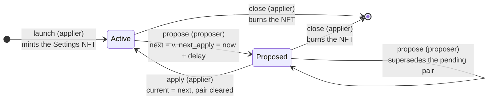

# Settings Protocol — Usage Guide

How to deploy, operate, and consume an instance of the **settings protocol**:
a delayed-apply governance contract for the configuration parameters of
another (the "main") protocol.

The entire state is a single **Settings UTxO**, uniquely identified by a
one-shot **Settings NFT**, whose inline datum holds the active configuration
(`current`) and an optional pending proposal (`next`, `next_apply`). A
**proposer** can only stage changes behind a configurable delay; an
**applier** commits or discards them.

> **Source of truth.** Behavior, threat model, and invariants are specified in
> [`spec.md`](spec.md).
> This guide only covers day-to-day usage.

| Part | Where |
|---|---|
| On-chain validator | [`onchain/validators/settings.ak`](../../onchain/validators/settings.ak) (+ composable predicates in [`onchain/lib/settings/`](../../onchain/lib/settings/)) |
| MeshJS builders | [`offchain/meshjs/lib/src/settings/`](../../offchain/meshjs/lib/src/settings/) |
| Tx3 protocol + client | [`offchain/tx3/settings/`](../../offchain/tx3/settings/) |
| Compiled blueprint | [`onchain/plutus.json`](../../onchain/plutus.json) |

## Contents

- [Lifecycle](#lifecycle)
- [Roles](#roles)
- [Deploying an instance](#deploying-an-instance)
- [Reading the settings (consumers)](#reading-the-settings-consumers)
- [Off-chain usage: MeshJS builders](#off-chain-usage-meshjs-builders)
- [Off-chain usage: Tx3 client](#off-chain-usage-tx3-client)
- [Gotchas and safety notes](#gotchas-and-safety-notes)
- [Where to go next](#where-to-go-next)

## Lifecycle

Every instance goes through the same cycle:



- **launch** — the applier mints exactly one Settings NFT under the script's
  own policy and locks it (with the initial value) in the Settings UTxO.
  Minting requires spending the parameterized `seed_utxo`, which makes the
  instance one-shot: at most one Settings UTxO can ever exist per script.
- **propose** — the proposer writes a pending pair
  `(next, next_apply = now + apply_delay)` into the datum. It cannot touch
  `current`, and a new proposal **supersedes** any pending one.
- **apply** — once `now >= next_apply` (`now` being the transaction's validity
  lower bound), the applier promotes `next` to `current` and clears the pair.
- **close** — the applier burns the NFT and recovers the locked lovelace.
  Closing is irreversible: the seed nonce is spent and the NFT is burned, so
  no instance can ever exist again at that script address.

## Roles

| Role | Credential | Powers |
|---|---|---|
| **Applier** | `apply_auth` | Launch, apply a matured proposal, close |
| **Proposer** | `propose_auth` | Propose (write / overwrite) the pending pair |
| **Consumer** | — | Reads `current` from the Settings UTxO as a reference input |

Both `propose_auth` and `apply_auth` are pluggable `Credential`s: a key
(required signer) or a script (invoked via a withdraw-0 reward withdrawal).
A multisig, DAO, or smart wallet can fill either role — see
[offchain/meshjs/lib/src/authorization.ts](../../offchain/meshjs/lib/src/authorization.ts)
and ARCHITECTURE.md §3.

## Deploying an instance

The validator is parameterized at deployment; these parameters are baked into
the script hash, and the script hash is both the NFT's policy id and the
payment credential of the Settings address:

| Parameter | Meaning |
|---|---|
| `seedUtxo` | One-shot mint nonce; must be spent by the launch transaction |
| `proposeAuth` | Credential allowed to `propose` |
| `applyAuth` | Credential allowed to launch, `apply`, and `close` |
| `applyDelay` | Minimum delay (milliseconds) between propose and earliest apply |
| `settingsTokenName` | Asset name of the instance NFT (default `"settings"` hex-encoded) |

The setting value itself is arbitrary `Data`. The reference validator accepts
anything (`validate_datum` is a `True` stub); the `settings_typed` fork
requires the value to be `Constr(0, [Int])`. If you need a real predicate,
fork the validator (§6.a of the spec).

## Reading the settings (consumers)

The main protocol never spends the Settings UTxO — it reads `current` by
adding the Settings UTxO to its transactions as a **reference input**:

- **On-chain (Aiken):** use
  [`onchain/lib/settings/utils.ak`](../../onchain/lib/settings/utils.ak) →

  ```aiken
  let settings = get_settings_datum(tx, settings_ref, policy, token_name)
  // settings.current is the active value
  ```

- **Off-chain:** look up the UTxO at the script address whose value contains
  exactly one asset with unit `policyId + settingsTokenName`, then decode its
  inline datum into `{ current, next, nextApply }`.

## Off-chain usage: MeshJS builders

The MeshJS builders are the primary developer-facing API. Install:

```sh
npm install @contracts-library/meshjs @meshsdk/core
```

### 1. Parameterize the script

```ts
import {
  SETTINGS_TOKEN_NAME,
  settingsScript,
  settingsScriptAddress,
  type SettingsParams,
} from "@contracts-library/meshjs";

const params: SettingsParams = {
  seedUtxo,                                                // the one-shot seed (TxInput)
  proposeAuth: { kind: "key", hash: proposerKeyHash },
  applyAuth: { kind: "key", hash: applierKeyHash },
  applyDelay: 3_600_000,                                   // 1 hour, in ms
  settingsTokenName: SETTINGS_TOKEN_NAME,                  // "73657474696e6773"
};

const script = settingsScript(params);
const scriptAddr = settingsScriptAddress(script, networkId);
```

Use `settingsTypedScript(params)` instead if you deploy the `settings_typed`
fork (integer-valued settings).

### 2. Launch

```ts
await buildLaunchTx({
  txBuilder,                    // a MeshTxBuilder wired to your provider/wallet
  script,
  seedUtxo,                     // must be the same UTxO the script was parameterized with
  datum: { current: initialValue, next: null, nextApply: null },
  outputIndex: 0,               // index of the Settings output
  utxos: applierUtxos,
  changeAddress: applierAddress,
  collateralUtxo,
  applyAuth: params.applyAuth,
  network: "preprod",
});
```

### 3. Propose

The builder converts `now` (unix ms) to the enclosing slot for the validity
lower bound and computes `nextApply = slotStart + applyDelay` with the same
slot-start conversion the validator uses.

```ts
const settingsUtxo = /* fetch the NFT-bearing UTxO at scriptAddr */;

await buildProposeTx({
  txBuilder,
  script,
  settingsUtxo,
  datum: spentDatum,            // the Settings UTxO's current datum
  newValue,                     // proposed value (Data) — must differ from `current`
  now: Date.now(),
  outputIndex: 0,
  utxos: proposerUtxos,
  changeAddress: proposerAddress,
  collateralUtxo,
  proposeAuth: params.proposeAuth,
  applyDelay: params.applyDelay,
  network: "preprod",
});
```

Proposing always writes a **fresh** pending pair: it overwrites any pending
proposal and resets the deadline to `now + apply_delay`.

### 4. Apply

```ts
await buildApplyTx({
  txBuilder,
  script,
  settingsUtxo,
  datum: spentDatum,            // must carry the pending proposal (next, nextApply)
  now: Date.now(),              // throws early if now < nextApply
  outputIndex: 0,
  utxos: applierUtxos,
  changeAddress: applierAddress,
  collateralUtxo,
  applyAuth: params.applyAuth,
  network: "preprod",
});
```

The builder throws before building when there is nothing to apply
(`next`/`nextApply` are `null`) or when the delay has not yet elapsed.

### 5. Close

```ts
await buildCloseTx({
  txBuilder,
  script,
  settingsUtxo,
  utxos: applierUtxos,
  changeAddress: applierAddress,
  collateralUtxo,
  applyAuth: params.applyAuth,  // irreversible — burn the NFT
  network: "preprod",
});
```

### Script-credential authorization

To fill `proposeAuth` / `applyAuth` with a **script** credential, pass the
approving script through the `authorizer` option on every builder call; the
library verifies the hash matches the credential and wires the withdraw-0:

```ts
proposeAuth: { kind: "script", hash: daoScriptHash },
authorizer: { scriptCbor: daoScriptCbor },            // redeemer defaults to unit
// or reference-based: authorizer: { reference: utxoCarryingTheScript, scriptHash: daoScriptHash }
```

## Off-chain usage: Tx3 client

The Tx3 implementation lives in
[`offchain/tx3/settings/`](../../offchain/tx3/settings/) with a generated
TypeScript client in
[`codegen/ts-client/config-parameter-management`](../../offchain/tx3/settings/codegen/ts-client/config-parameter-management/README.md)
(regenerate with `trix codegen`; do not edit by hand).

Install the runtime SDK in the directory that consumes the client:

```sh
npm install tx3-sdk
```

### Set up the client

```ts
import { Client } from "./codegen/ts-client/config-parameter-management";
import { Party } from "tx3-sdk";

const client = new Client({ endpoint: "http://localhost:8164" }, "local")
  .withProposer(proposerParty)              // the propose_auth credential
  .withApplier(applierParty)                // the apply_auth credential (fees for launch/apply/close)
  .withSettings(Party.address(scriptAddr)); // holder of the Settings UTxO
```

Bind the protocol environment once per instance — the parameterized script
(flat single-CBOR, as accepted by the mint/spend witness), its hash, and the
delay:

```ts
const env = {
  settings_hash: scriptHash,
  settings_script: flatScriptCbor,
  apply_delay: 3_600_000,
  // only required for the *_script_authorized paths:
  proposer_script_ref: proposerRefUtxo,
  proposer_script_address: proposerRewardAddressBytes,
  applier_script_ref: applierRefUtxo,
  applier_script_address: applierRewardAddressBytes,
};
```

Every `tx` exposes the four-stage lifecycle `resolve → sign → submit → wait`
(see the [Tx3 consuming guide](https://docs.txpipe.io/tx3/consuming/quick-start)).

### Key-authorized actions

```ts
// Launch: mint the NFT and create the Settings UTxO
await client
  .launch({ seed: seedRef, initial_value: value, out_ix: 0 })
  .env(env)
  .resolve()
  .then((r) => r.sign())
  .then((s) => s.submit());

// Propose: `now_ms` is the validity lower bound in unix ms and `since_slot`
// the slot denoting the same instant; next_apply = now_ms + apply_delay
await client
  .propose({ new_value: value, now_ms: now, since_slot: slot, out_ix: 0 })
  .env(env)
  .resolve()
  .then((r) => r.sign())
  .then((s) => s.submit());

// Apply: promote the pending `next` — must equal it, and `since_slot` must be
// at or after `next_apply`
await client
  .apply({ new_current: value, since_slot: slot, out_ix: 0 })
  .env(env)
  .resolve()
  .then((r) => r.sign())
  .then((s) => s.submit());

// Close: burn the NFT and recover the lovelace (irreversible)
await client
  .close({})
  .env(env)
  .resolve()
  .then((r) => r.sign())
  .then((s) => s.submit());
```

The settings value travels as opaque `Bytes` (the Tx3 stand-in for on-chain
`Data`).

### Script-authorized variants

When `propose_auth` / `apply_auth` is a script credential, use the
`*_script_authorized` counterparts (`launchScriptAuthorized`,
`proposeScriptAuthorized`, `applyScriptAuthorized`, `closeScriptAuthorized`).
The named party remains the fee-paying signer while the authorizing script is
loaded from a **reference input** (`proposer_script_ref` / `applier_script_ref`)
and invoked via a withdraw-0 keyed by its reward address
(`proposer_script_address` / `applier_script_address`).

> Note: the generated parameter types may name fields in camelCase while the
> Tx3 template's runtime arguments are snake_case (see
> [`offchain/tx3/settings/tests/devnet.test.ts`](../../offchain/tx3/settings/tests/devnet.test.ts)
> for the exact call shapes used in CI).

## Gotchas and safety notes

- **Proposals supersede each other.** A new `propose` overwrites the pending
  pair and resets the deadline — there is no proposal queue.
- **The delay anchor is proposer-chosen.** `next_apply = now + apply_delay`
  uses the propose transaction's validity lower bound, which the proposer
  picks. The delay is a scheduling tool, not a hard real-time guarantee
  against a malicious proposer (§6.a of the spec).
- **The apply boundary is non-strict.** `now == next_apply` is accepted.
- **Closing is irreversible.** The seed nonce is spent and the NFT burned —
  the same script hash can never host a second instance. Re-deploy with a new
  seed to start over (new script hash).
- **The staking credential is frozen at launch.** Every continuation must
  reproduce the spent UTxO's full address; move the instance to a new staking
  key only via a fresh deployment.
- **`validate_datum` is a stub.** Nothing validates the *meaning* of the
  value unless you deploy the `settings_typed` fork or your own fork.
- **Slot/ms rounding.** Builders compute `next_apply` from the slot-start
  millisecond conversion; keep that convention if you write your own builders.

## Where to go next

- [Spec](spec.md) — full behavior,
  threat model (§6), invariants, and the formal must-accept/must-reject
  characterization.
- [On-chain code](../../onchain/validators/settings.ak) — reference
  validator; composable predicates in [`onchain/lib/settings/`](../../onchain/lib/settings/).
- [Devnet e2e test](../../offchain/tx3/settings/tests/devnet.test.ts) —
  end-to-end usage of both key- and script-authorized paths, including the
  negative (must-reject) cases.
- [Architecture](../ARCHITECTURE.md) — composability conventions shared by
  every contract in the library.
