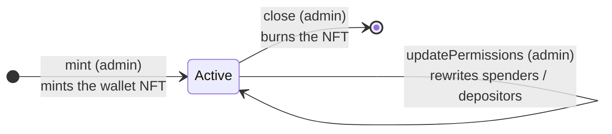

# Smart Wallet — Usage Guide

How to deploy, operate, and consume a **smart wallet**: a single UTxO holding
funds behind a *configurable* set of spending restrictions. The wallet is a
multivalidator — a one-shot minting policy that creates its identifying NFT,
plus a spending script — with a fixed **base M-of-N signature floor** and two
lists of **delegated withdrawal scripts**: `spenders` (run on every spend) and
`depositors` (run on every deposit, validating what may be added).

The wallet UTxO is uniquely identified by a one-shot **wallet NFT** minted
under the script's own policy. Its inline datum carries two maps, each mapping
a script hash → that script's own `Data`: `spenders` (spend restrictions and
mutable state) and `depositors` (deposit validation). The `admin` that creates,
reconfigures, and closes the wallet is a **compile-time parameter**; the M-of-N
`members`/`threshold` are read at runtime from a settings UTxO (the reference's
config source — see
[Prerequisite: a settings instance](#prerequisite-a-settings-instance)), so
they can change without redeploying the wallet.

> **Source of truth.** Behavior, threat model, and invariants are specified in
> [`spec.md`](spec.md) (status: *Draft, first version*).
> This guide only covers day-to-day usage.

| Part | Where |
|---|---|
| On-chain validator | [`onchain/validators/smart_wallet/`](../../onchain/validators/smart_wallet/) (+ composable predicates in [`onchain/lib/smart_wallet/`](../../onchain/lib/smart_wallet/)) |
| MeshJS builders | [`offchain/meshjs/lib/src/smart_wallet/`](../../offchain/meshjs/lib/src/smart_wallet/) |
| Tx3 protocol + client | [`offchain/tx3/smart_wallet/`](../../offchain/tx3/smart_wallet/) |
| Compiled blueprint | [`onchain/plutus.json`](../../onchain/plutus.json) |

## Contents

- [Lifecycle](#lifecycle)
- [Roles](#roles)
- [Prerequisite: a settings instance](#prerequisite-a-settings-instance)
- [Deploying a wallet](#deploying-a-wallet)
- [Off-chain usage: MeshJS builders](#off-chain-usage-meshjs-builders)
- [Delegated withdrawal scripts](#delegated-withdrawal-scripts)
- [Off-chain usage: Tx3 client](#off-chain-usage-tx3-client)
- [Gotchas and safety notes](#gotchas-and-safety-notes)
- [Where to go next](#where-to-go-next)

## Lifecycle

A wallet is a single UTxO; every action spends and recreates it (or destroys
it). Only `Close` is terminal:



- **mint** — the admin spends the parameterized `seed_utxo` and mints exactly
  one wallet NFT under the script's own policy, into a fresh wallet UTxO. Every
  script in the initial `spenders` and `depositors` maps must be *registered* in
  the same transaction (see
  [withdrawal scripts](#delegated-withdrawal-scripts)).
- **deposit** — every script in `depositors` must be invoked as a withdraw-0 and
  approve; with an empty map, deposits are open. The continuation keeps
  `spenders` and the `depositors` keys identical and its value must be a
  superset of the input's, so a deposit can never spend or reconfigure. The
  `spenders` scripts do **not** run.
- **spend** — pays out. At least `threshold` of `members` must sign, every
  script in `spenders` must be invoked as a withdraw-0 and approve, and the
  wallet must survive: an NFT-bearing continuation with `depositors` unchanged,
  the `spenders` key set fixed, and no value gained. A partial spend keeps the
  NFT in a change output at the wallet address.
- **updatePermissions** — the admin rewrites `spenders` and/or `depositors` in
  place: same address, a continuation value no smaller than the input's (no
  asset may decrease), inline datum with the new config.
- **close** — the admin spends the wallet UTxO, releases the remaining funds,
  burns the NFT, and unregisters every delegated script. Closing is
  irreversible: the seed nonce is spent, so the wallet can never be relaunched
  at this script address.

## Roles

| Role | Credential | Powers |
|---|---|---|
| **Admin** | `admin` (script parameter) | Mint, `UpdatePermissions`, `Close` |
| **Deposit scripts** | keys of `depositors` (datum field) | Validate and approve every `Deposit` |
| **Members** | `members`/`threshold` (settings UTxO) | Sign a `Spend` |
| **Spender scripts** | keys of `spenders` (datum field) | Run and approve on every `Spend` |

`admin` is a pluggable `Credential`: a key (required signer) or a script
(invoked via a withdraw-0 reward withdrawal). A multisig, DAO, or another smart
wallet can fill the role — see
[offchain/meshjs/lib/src/authorization.ts](../../offchain/meshjs/lib/src/authorization.ts)
and ARCHITECTURE.md §3. Deposits have no dedicated credential: the
`depositors` scripts are the only gate (a key check is itself a deposit
script), and an empty map leaves deposits open. Members are **verification key
hashes** today (see [gotchas](#gotchas-and-safety-notes)).

## Prerequisite: a settings instance

The reference validator reads its base M-of-N config from the settings
protocol's opaque `current` datum. Deploying it as-is therefore needs a live
settings instance (see the
[settings usage guide](../settings/usage.md)) whose `current` is:

```ts
import {
  walletConfigToData,
  type SettingsDatum,
  type WalletConfig,
} from "@contracts-library/meshjs";

const walletConfig: WalletConfig = {
  members: [memberAKeyHash, memberBKeyHash],  // verification key hashes (hex)
  threshold: 2,                               // at least 2 of them must sign
};

// Stored as the settings UTxO's `current`:
const settingsDatum: SettingsDatum = {
  current: walletConfigToData(walletConfig),
  next: null,
  nextApply: null,
};
```

Launch the settings instance with `buildLaunchTx` (see the
[settings guide](../settings/usage.md#2-launch)); its NFT is located by
`settingsPolicy` / `settingsTokenName` at spend time via reference input. Only
`Spend` reads the config — `Deposit`, `UpdatePermissions`, and `Close` do not
require the settings UTxO. Changing members/threshold through the settings
protocol takes effect for the next spend immediately (no snapshot). A
malformed or missing `current` halts spending until fixed.

The settings instance is the **reference configuration source, not a fixed
part of the mechanism**. The floor itself is a pure predicate
(`members_signed` in
[`onchain/lib/smart_wallet/checks.ak`](../../onchain/lib/smart_wallet/checks.ak))
over `(members, threshold, extra_signatories)`; the reference `Spend` branch
just happens to read the first two from a settings UTxO. If you embed the
predicates in your own validator (or fork the reference), source the config
however you need — compile-time parameters, another on-chain config, an
oracle — and the rest of the wallet semantics stay unchanged (see
[`design.typ`](design.typ)).

## Deploying a wallet

The validator is parameterized at deployment; these parameters are baked into
the script hash, which is both the wallet NFT's policy id and the payment
credential of the wallet address (the address has **no staking credential**):

| Parameter | Meaning |
|---|---|
| `seedUtxo` | One-shot mint nonce: the mint transaction must spend it |
| `settingsPolicy` | Settings script hash (= settings NFT policy id) |
| `settingsTokenName` | Settings NFT asset name (hex) |
| `walletTokenName` | Asset name of the wallet's identifying NFT (hex) |
| `admin` | `Credential` allowed to mint, update config, and close |

```ts
import {
  smartWalletScript,
  smartWalletScriptAddress,
  SETTINGS_TOKEN_NAME,
  type WalletParams,
} from "@contracts-library/meshjs";
import { resolveScriptHash } from "@meshsdk/core";

const WALLET_TOKEN_NAME = "57414c4c4554"; // hex "WALLET"

const params: WalletParams = {
  seedUtxo: walletSeed.input,                 // the one-shot seed (TxInput)
  settingsPolicy: resolveScriptHash(settings.code, settings.version),
  settingsTokenName: SETTINGS_TOKEN_NAME,     // "73657474696e6773"
  walletTokenName: WALLET_TOKEN_NAME,
  admin: { kind: "key", hash: adminKeyHash },
};

const script = smartWalletScript(params);
const scriptAddr = smartWalletScriptAddress(script, networkId);
const walletHash = resolveScriptHash(script.code, script.version); // NFT policy id
```

Each distinct `seedUtxo` yields a distinct script hash, so one script address
hosts at most one wallet (one-shot mint). Deploy several wallets by
parameterizing with different seeds.

## Off-chain usage: MeshJS builders

The MeshJS builders are the primary developer-facing API. Install:

```sh
npm install @contracts-library/meshjs @meshsdk/core
```

### 1. Mint (create the wallet)

Mints the NFT, spends the seed, and writes the initial datum. The builder adds
the admin as a required signer (key credential) and registers every script in
the initial `spenders` and `depositors` maps:

```ts
import {
  buildWalletMintTx,
  type WalletDatum,
} from "@contracts-library/meshjs";

const datum: WalletDatum = {
  spenders: [],                            // spend restrictions (or initial scripts)
  depositors: [],                          // deposit validation (empty = deposits open)
};

await buildWalletMintTx({
  txBuilder,
  script,
  walletTokenName: WALLET_TOKEN_NAME,
  seedUtxo: walletSeed,                       // must equal the parameterization seed
  datum,
  outputIndex: 0,                             // index of the wallet output
  utxos: adminUtxos,
  changeAddress: adminAddress,
  collateralUtxo,
  admin: { kind: "key", hash: adminKeyHash },
  registerScripts: [],                        // one per script in either map
  network: "preprod",
});
```

The wallet output carries the NFT plus at least `1.5` ADA. Fetch the resulting
NFT-bearing UTxO at `scriptAddr` — that is the wallet for every subsequent
action.

### 2. Deposit

Adds assets without spending or reconfiguring. `spenders` must be passed back
unchanged and `depositors` must keep the same keys (their `data` may advance);
every `depositors` entry must be invoked. With an empty `depositors` map,
deposits are open:

```ts
import { buildWalletDepositTx } from "@contracts-library/meshjs";

await buildWalletDepositTx({
  txBuilder,
  script,
  walletUtxo,
  datum: walletDatum,                         // spenders unchanged; depositors keys fixed
  deposit: [{ unit: "lovelace", quantity: "2000000" }],
  outputIndex: 0,
  utxos: depositorUtxos,
  changeAddress: depositorAddress,
  collateralUtxo,
  depositorScripts: [],                       // every script in `depositors`
  network: "preprod",
});
```

### 3. Spend

Pays out from the wallet. The builder adds each member in `signers` as a
required signer, invokes each `spenderScripts` entry as a withdraw-0, and adds
the settings UTxO as a reference input:

```ts
import { buildWalletSpendTx } from "@contracts-library/meshjs";

await buildWalletSpendTx({
  txBuilder,
  script,
  walletUtxo,
  settingsUtxo,                               // reference input carrying WalletConfig
  datum: walletDatum,                         // continuation datum (advance spender state)
  payoutAddress,
  payoutAmount: [{ unit: "lovelace", quantity: "3000000" }],
  changeAmount,                               // remaining wallet value, keeps the NFT
  outputIndex: 0,
  utxos: memberUtxos,
  changeAddress,
  collateralUtxo,
  signers: [memberAKeyHash, memberBKeyHash],  // members satisfying the M-of-N floor
  spenderScripts: [limit],                    // every script in `spenders`
  invalidBeforeSlot,                          // required by scripts that read `now`
  network: "preprod",
});
```

`changeAmount` is yours to compute: subtract the payout from the wallet's
assets and **keep the NFT plus enough ADA for min-UTxO**. The continuation
value must be a subset of the wallet UTxO's (a spend only removes value), its
`depositors` must be identical and its `spenders` keys fixed. The on-chain
`Spend` requires that continuation, so a spend that strands the NFT is
rejected.

### 4. Update permissions

The admin rewrites `spenders` and/or `depositors`. Funds cannot move: the
builder reuses the input's value and address:

```ts
import { buildWalletUpdatePermissionsTx } from "@contracts-library/meshjs";

await buildWalletUpdatePermissionsTx({
  txBuilder,
  script,
  walletUtxo,
  newDatum,                                   // new spenders and/or depositors
  outputIndex: 0,
  utxos: adminUtxos,
  changeAddress: adminAddress,
  collateralUtxo,
  admin: { kind: "key", hash: adminKeyHash },
  registerScripts: [],                        // scripts added by this update (either map)
  deregisterScripts: [],                      // scripts removed by this update (either map)
  network: "preprod",
});
```

Every script *added* must be registered here; every script *removed* must be
unregistered; every script *kept* (in either map) must carry
**byte-identical** `Data` (change a script's state by removing and re-adding
it).

### 5. Close

Burns the NFT and releases the remaining funds. Every script in the wallet's
`spenders` and `depositors` maps must be unregistered so its stake deposit is
refunded:

```ts
import { buildWalletCloseTx } from "@contracts-library/meshjs";

await buildWalletCloseTx({
  txBuilder,
  script,
  walletTokenName: WALLET_TOKEN_NAME,
  walletUtxo,
  utxos: adminUtxos,
  changeAddress: adminAddress,
  collateralUtxo,
  admin: { kind: "key", hash: adminKeyHash },
  deregisterScripts: [...scriptsInWallet],    // every script in both maps
  network: "preprod",
});
```

### Script-credential authorization

To fill `admin` with a **script** credential, pass the approving script through
the `authorizer` option on every builder call that authorizes that role
(`buildWalletMintTx`, `buildWalletUpdatePermissionsTx`, `buildWalletCloseTx`).
The library verifies the hash matches the credential and wires the withdraw-0:

```ts
admin: { kind: "script", hash: daoScriptHash },
authorizer: { scriptCbor: daoScriptCbor },             // redeemer defaults to unit
// or reference-based: authorizer: { reference: utxoCarryingTheScript, scriptHash: daoScriptHash }
```

Key credentials need no `authorizer` — the builder adds the required signer.
Deposits have no credential to authorize: pass every script in the `depositors`
map via `depositorScripts` and the library invokes them as withdraw-0.

## Delegated withdrawal scripts

A delegated script is a **withdraw-0 staking script** pinned to one wallet. It
lives in the wallet datum's `spenders` map (run on every `Spend`) or
`depositors` map (run on every `Deposit`); its entry
(`spenders[scriptHash]` / `depositors[scriptHash]`) is that script's own `Data`
(mutable state for spenders; configuration or state for depositors). It
participates through two handlers:

- **`publish`** — runs on `RegisterCredential` / `UnregisterCredential`
  certificates. On registration it reads its initial `Data` from the wallet
  **output** datum and validates it, so a wallet cannot delegate a script
  without the script self-validating its starting state. On unregistration it
  only accepts the removal when it is actually leaving the wallet — an
  out-of-band unregister (which would brick the wallet) is rejected.
- **`withdraw`** — runs as a reward withdrawal required on every `Spend`
  (spenders) or `Deposit` (depositors). A stateful spender script reads its
  current `Data` from the wallet **input** datum, validates the transition, and
  requires the wallet **output** datum to record the new state; a stateful
  deposit script does the same on a `Deposit`.

The reference validators are `spending_limit` and `spending_window`. Both are
parameterized by the **wallet's payment credential**, so one script instance
works with exactly one wallet.

### `spending_limit`

Bounds the wallet's net ADA outflow: sums the lovelace held at the wallet
credential across inputs and outputs and requires
`input - output < bound` (strict). Its state is a trivial marker (`0`):

```ts
import {
  spendingLimitScript,
  type WalletDatum,
} from "@contracts-library/meshjs";
import { resolveScriptHash } from "@meshsdk/core";

const limit = spendingLimitScript({
  wallet: { kind: "script", hash: walletHash },
  bound: 5_000_000,                           // net outflow must stay below 5 ADA
});
const limitHash = resolveScriptHash(limit.code, limit.version);

const datum: WalletDatum = {
  spenders: [{ scriptHash: limitHash, data: 0 }],
  depositors: [],
};
```

Mint with `registerScripts: [limit]`, spend with `spenderScripts: [limit]`,
and close with `deregisterScripts: [limit]`.

### `spending_window`

Stateful: allows at most one spend per `window` milliseconds. The state is
`SpendingWindowState { last_spend }` (POSIX ms; `0` = never spent, validated on
registration). Its `withdraw` handler reads `now` from the validity range's
**lower bound** and requires the cooldown elapsed *and* the output state to
record exactly this spend:

```ts
import {
  spendingWindowScript,
  spendingWindowStateToData,
} from "@contracts-library/meshjs";
import { unixTimeToEnclosingSlot } from "@meshsdk/core";

const window = spendingWindowScript({
  wallet: { kind: "script", hash: walletHash },
  window: 3_600_000,                          // one hour, in ms
});
const windowHash = resolveScriptHash(window.code, window.version);

// Initial state, at mint:
const initialDatum = {
  spenders: [{ scriptHash: windowHash, data: spendingWindowStateToData({ lastSpend: 0 }) }],
  depositors: [],
};

// On each spend, carry the advanced state and set the validity lower bound:
const startMs = (slot: number) =>
  slotConfig.zeroTime + (slot - slotConfig.zeroSlot) * slotConfig.slotLength;
const slot = unixTimeToEnclosingSlot(nowMs, slotConfig);
const nextDatum = {
  ...initialDatum,
  spenders: [{
    scriptHash: windowHash,
    data: spendingWindowStateToData({ lastSpend: startMs(slot) }),
  }],
};
// buildWalletSpendTx({ ..., datum: nextDatum, invalidBeforeSlot: slot, ... })
```

`startMs(slot)` is the slot's start in POSIX ms; the state must use the same
slot-start convention the validator reads from the validity range lower bound.

For custom scripts and hand-assembled transactions, the library exports
`registerWithdrawalScript`, `deregisterWithdrawalScript`, and
`invokeWithdrawalScript` (the builders call them internally via
`registerScripts` / `deregisterScripts` / `spenderScripts` /
`depositorScripts`), plus `withdrawalScriptAddress` for the script's reward
address. Depositor scripts use the same mechanics: publish on
`Mint`/`UpdatePermissions`, invoke on `Deposit`, unregister on
`UpdatePermissions`/`Close`.

## Off-chain usage: Tx3 client

> **Stale — pending offchain pass.** The Tx3 template/client below still targets
> the previous datum shape (`withdrawals` / `depositor`) and the old
> `UpdateConfig` naming. It has not been updated to the current protocol
> (`spenders` / `depositors`, `UpdatePermissions`); treat it as outdated until
> the Tx3 pass.

The Tx3 implementation lives in
[`offchain/tx3/smart_wallet/`](../../offchain/tx3/smart_wallet/) with a generated
TypeScript client in `codegen/ts-client/smart-wallet` (regenerate it from
[`main.tx3`](../../offchain/tx3/smart_wallet/main.tx3) with `trix codegen`; do
not edit by hand).

Install the runtime SDK in the directory that consumes the client:

```sh
npm install tx3-sdk
```

### Set up the client

```ts
import { Client } from "./codegen/ts-client/smart-wallet/protocol";
import { Party } from "tx3-sdk";

const client = new Client({ endpoint: "http://localhost:8164" }, "local")
  .withAdmin(adminParty)                      // creates, reconfigures, closes; funds the seed
  .withDepositor(depositorParty)              // adds funds only
  .withMember(memberParty)                    // the M-of-N signer (one key per party)
  .withWallet(Party.address(walletAddr))
  .withSettings(Party.address(settingsAddr));
```

Bind the protocol environment once per instance — the parameterized script
hash, its flat single-CBOR form, and the settings instance:

```ts
const env = {
  wallet_hash: walletHash,                    // also the NFT policy id
  wallet_script: flatWalletCbor,              // single-CBOR flat validator
  wallet_token_name: WALLET_TOKEN_NAME,
  settings_hash: settingsHash,
  settings_script: flatSettingsCbor,
};
```

Every `tx` exposes the four-stage lifecycle `resolve → sign → submit → wait`
(see the [Tx3 consuming guide](https://docs.txpipe.io/tx3/consuming/quick-start)).

### Key actions

```ts
// Launch a settings instance holding the wallet's M-of-N config (fixture)
await client
  .launchSettings({ seed: settingsSeedRef, wallet_config: walletConfig, out_ix: 0 })
  .env(env).resolve().then((r) => r.sign()).then((s) => s.submit());

// Create the wallet: spend the one-shot seed, mint the NFT (empty spenders)
await client
  .mintWallet({ seed: walletSeedRef, depositor: keyCred(depositorKeyHash), out_ix: 0 })
  .env(env).resolve().then((r) => r.sign()).then((s) => s.submit());

// Deposit: the depositor adds ADA; datum and value otherwise preserved
await client
  .deposit({ deposit_ada: 1_000_000, out_ix: 0 })
  .env(env).resolve().then((r) => r.sign()).then((s) => s.submit());

// Spend: the M-of-N floor signs; the wallet continues with the remainder
await client
  .spend({ settings_ref: settingsRef, payout_address: memberAddress, payout_ada: 1_000_000 })
  .env(env).resolve().then((r) => r.sign()).then((s) => s.submit());

// Update config: the admin rewrites the depositor
await client
  .updateConfig({ new_depositor: keyCred(adminKeyHash), out_ix: 0 })
  .env(env).resolve().then((r) => r.sign()).then((s) => s.submit());

// Close: burn the NFT and release the funds (irreversible)
await client
  .close({})
  .env(env).resolve().then((r) => r.sign()).then((s) => s.submit());
```

In the Tx3 wire form the `WalletConfig` members are `Bytes`, not hex strings —
unlike the MeshJS mirror. The generated parameter types may name fields in
camelCase while the template's runtime arguments are snake_case; cast at each
call site, as the reference suite does
([`offchain/tx3/smart_wallet/tests/devnet.test.ts`](../../offchain/tx3/smart_wallet/tests/devnet.test.ts)).

### Scope: no delegated withdrawal scripts

Tx3 v1beta0 has no block for Cardano registration/unregistration certificates,
which the on-chain `Mint` / `UpdatePermissions` / `Close` endpoints require (CIP-69
`publish` handlers). Consequently **every wallet produced by this reference
carries an empty `spenders` map**, where the on-chain publication and
unregistration checks are vacuously true. Spending a wallet that already
delegates to scripts remains valid on-chain, but such a wallet cannot be
produced or torn down through Tx3 until upstream certificate support lands
([tx3-lang/tx3#164](https://github.com/tx3-lang/tx3/issues/164)). The map's
values travel as opaque `Bytes` and are only usable empty today.

The reference implements the **key-authorized** paths only: `Admin`,
`Depositor`, and `Member` are bound to key credentials. The M-of-N floor
supports N members on-chain, but a Tx3 party is a single key, so the reference
and its tests use a 1-of-1 wallet.

## Gotchas and safety notes

- **The admin is immutable.** `admin` is a compile-time parameter, so control
  cannot be handed off without redeploying (a new script hash/address). The
  spec's roadmap is to express admin authorization as an ordinary delegated
  withdrawal script.
- **Members are key hashes today.** `WalletConfig.members` is
  `List<VerificationKeyHash>` and `Spend` counts required signers, so the
  design's aspiration that a member may itself be a script credential is not
  implemented. A floor of script credentials needs a custom fork.
- **Wallet-parameterized scripts cannot be shared.** Each `spending_limit` /
  `spending_window` instance pins one wallet credential in its hash, so its
  mutable state belongs to exactly one wallet. Sharing one script instance
  across wallets is on the roadmap, not implemented.
- **One wallet per script address.** The one-shot seed mints a single NFT ever;
  parameterizing a fresh deployment with the same seed produces the same script
  hash and cannot mint a second wallet.
- **Closing is irreversible.** The seed nonce is spent and the NFT burned; the
  same script hash can never host another wallet.
- **The wallet must survive a spend.** `Spend` requires an NFT-bearing
  continuation at the wallet address, with `depositors` unchanged, the
  `spenders` key set fixed, and a value no greater than the input's. Removing
  the NFT or adding value is rejected; only `Close` destroys the wallet.
- **The settings config is trusted.** The wallet reads `members`/`threshold`
  from the settings `current` without validating the settings contract; whoever
  controls the settings instance controls spend authority. A malformed
  `current` (or `threshold > members` count) makes every spend fail.
- **Deposits run the deposit scripts, not the spenders.** Every `depositors`
  script must be invoked as a withdraw-0 (with an empty map, deposits are
  open). `spenders` must come back byte-identical and the `depositors` keys
  fixed; depositor `Data` may advance, with each script enforcing its own
  transition.
- **Permission keys are admin-only.** Adding or removing entries in `spenders`
  or `depositors` is reserved for `UpdatePermissions`: a `Spend` keeps the
  `spenders` key set fixed (and `depositors` fully unchanged) and a `Deposit`
  keeps the `depositors` key set fixed.
- **Delegated scripts are trusted.** The core does not bound an entry's `Data`
  size or semantics: a buggy or malicious script can bloat the datum, rewrite
  its own state, or refuse to unregister (blocking `Close`/removal). Vet scripts
  before delegating them — see [`spec.md`](spec.md) §6.
- **Kept scripts must be byte-identical.** `UpdatePermissions` compares each kept
  script's `Data` by CBOR serialization; changing state means removing
  (unregistering) and re-adding (re-registering) the script in the same
  transaction.
- **`spending_limit` is strict.** The boundary is `input - output < bound`; a
  payout exactly equal to `bound` is rejected. Sums cover every UTxO at the
  wallet's payment credential on both sides, so a spend that recreates value at
  the wallet address nets it out.
- **Stateful scripts need the slot convention.** `spending_window` reads `now`
  from the validity range's lower bound and requires the output state to equal
  it, so always set `invalidBeforeSlot` (or `invalid_before`) and write the
  slot's start milliseconds into `lastSpend`.
- **Script credentials need manual wiring (MeshJS).** The builders add required
  signers for key credentials only; to authorize as a script (multisig, DAO,
  smart wallet) as `admin`, pass the `authorizer` option (see
  [`offchain/meshjs/lib/src/authorization.ts`](../../offchain/meshjs/lib/src/authorization.ts)
  and ARCHITECTURE.md §3). Depositor scripts are not a credential: invoke them
  through `depositorScripts`.
- **Tx3 carries no withdrawal scripts.** Until upstream certificate support,
  Tx3 wallets are empty-`spenders`, key-authorized, and their attack-path /
  devnet-kit transactions (`spendWithoutMemberSignatureAttack`, `devnetPay`, …)
  are test-only — never use them in production.

## Where to go next

- [Spec](spec.md) — full behavior, invariants (§7), threat model (§8), and the
  protocol roadmap (§2).
- [Design](design.typ) — transaction diagrams for mint, spend, update
  permissions, deposit, close, and the stateful spending-window example.
- [On-chain code](../../onchain/validators/smart_wallet/) — reference
  validators; composable predicates and the withdrawal-script framework in
  [`onchain/lib/smart_wallet/`](../../onchain/lib/smart_wallet/).
- [MeshJS e2e tests](../../offchain/meshjs/e2e/test/smart_wallet.e2e.test.ts) —
  the core lifecycle plus `spending_limit` / `spending_window` against a Yaci
  devnet, including must-reject cases.
- [Tx3 devnet test](../../offchain/tx3/smart_wallet/tests/devnet.test.ts) and
  [Tx3 README](../../offchain/tx3/smart_wallet/README.md) — the key-authorized
  core lifecycle with the generated client.
- [Settings usage guide](../settings/usage.md) — operating the settings
  instance that governs this wallet's M-of-N floor.
- [Architecture](../ARCHITECTURE.md) — composability conventions shared by
  every contract in the library.
